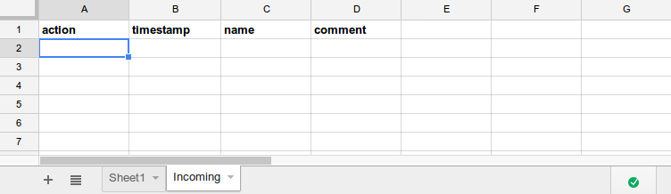

sheetlabs-google-restproxy
==========================

gscript + nodejs rest-proxy which turn a google spreadsheet in sheetlabs.com into a full REST api

# Why?

Sheetlabs is a publish-only platform when it comes to spreadsheets.
It works really nice, and focuses on generating GET-api's.
If you want a full fledged REST service (POST/PUT/DELETE), one needs to get funky..and I think I just did.

# How?

By putting this nodejs application (a REST-proxy) in front of your sheetlabs api, you can 
reroute PUT/POST/DELETE-calls to a gscript which is connected to your spreadsheet.
From there you can decide what to do with those requests.
 
 

# Installation

first create a spreadsheet with tabs 'Sheet1' and 'Incoming' like so:

 
 

 
 
* click 'Tools' > 'Script Editor' and copy/paste the contents of 'script.gs' into the Editor
* follow the instructions which are written in top of the script
* click 'Publish' > 'Deploy as webapp' and copy/paste the app-url 
  
Now turn this spreadsheet into an api at sheetlabs.com, this eventually will give you an api-url.
 
 

then clone this repo

    $ cd sheetlabs-google-restproxy
    $ vi app.js 
    (copy/paste the google appurl into the 'resturl' variable)
    (copy/paste the sheetapi.com api-url into the 'sheetlaburl' variable  )
    $ node app.js 

Now do some requests 

And you should end up seeing something like this:

# Notes 

* Google gscript/spreadsheet api is slooowwww..not recommended for highvolume traffic

the google appscript is currently configured to route POST-request into the 'Sheet1'-tab, and the PUT/DELETE into 'Incoming. This is for example purposes only, you can modify it to your likings.
